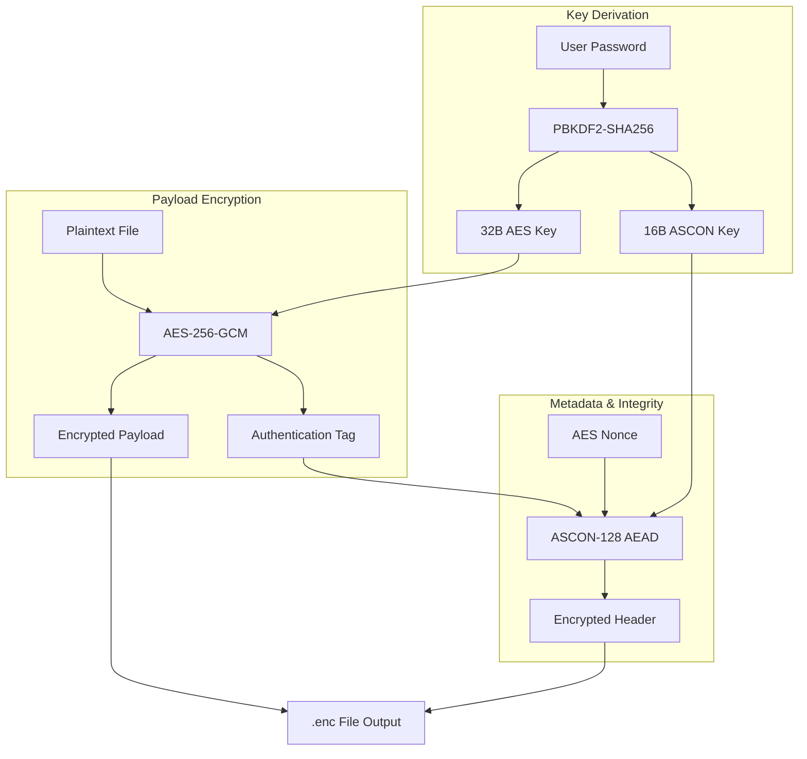

# SecureFile: Enterprise Hybrid Cryptographic Vault
[](https://opensource.org/licenses/MIT)
[](https://www.python.org/downloads/)
[](https://csrc.nist.gov/publications/detail/sp/800-38d/final)

**Group 12 Mini-Project**  
*Academic Research Prototype — Not for Production Use*

## Overview
SecureFile is a high-assurance file encryption architecture designed to mitigate advanced persistent threats and offline tampering. By implementing a **nested hybrid cryptographic scheme**, it provides strong confidentiality through **AES-256-GCM** and lightweight metadata integrity through **ASCON-128**, an authenticated encryption cipher selected by NIST for lightweight applications.

## Technical Architecture

### Cryptographic Stack
1.  **Transport/Bulk Layer**: `AES-256-GCM` — High-performance authenticated encryption for file payloads.
2.  **Metadata Binding Layer**: `ASCON-128` — Protects bulk-layer nonces and tags from pre-computation or substitution attacks.
3.  **Key Derivation**: `PBKDF2-HMAC-SHA256` — 100,000 iterations to resist GPU-accelerated brute force.
4.  **Admin Recovery**: `RSA-3072` (OAEP Padding) — Asymmetric bypass mechanism for emergency access.

### System Flow


## Threat Model & Security Analysis

| Threat Segment | Targeted Mitigation | Effectiveness |
| :--- | :--- | :--- |
| **Brute-Force Attack** | PBKDF2 w/ 100k rounds + Account Lockout (3 attempts) | High (Prevents offline/online guessing) |
| **Metadata Forgery** | ASCON-128 Authenticated Encryption (AEAD) | High (Integrity bounds metadata to payload) |
| **Offline Tampering** | AES-GCM Tag Verification (Inner Layer) | Ultra (Detects even single-bit changes) |
| **Admin Key Theft** | RSA-3072 Asymmetric Recovery Logic | High (Separation of duties) |
| **Side-Channel Analysis** | Constant-time operation (Library-dependent) | Medium (Environment Dependent) |

## Usage Guide

### 1. Initialization
Generate the RSA recovery pair. **Keep `recovery_key.pem` secure and offline.**
```powershell
python secure_vault.py init
```

### 2. Encryption
Secure any file with a strong master password.
```powershell
python secure_vault.py encrypt secret_data.txt --password "MySUp3rS3cr3t"
```

### 3. Decryption
Restore access to your encrypted vault.
```powershell
python secure_vault.py decrypt secret_data.txt.enc --password "MySUp3rS3cr3t"
```

### 4. Emergency Recovery
Reset Strike limits or regain access if the master password is lost using the RSA Private Key.
```powershell
python secure_vault.py recover --key recovery_key.pem
```

## Project Files
- `secure_vault.py`: Core Enterprise Engine.
- `tamper.py`: Forensic tool for simulating integrity failures.
- `exploit_poc.py`: Proof-of-concept demonstration of brute-force resistance.
- `SecureFile_Research_Paper.pdf`: Accompanying academic justification.

---
*Developed for the Modern Cryptography course. All rights reserved.*
